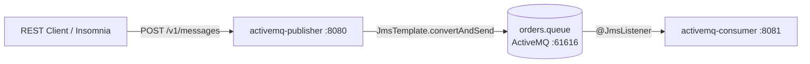

# learning-activemq

Spring Boot + ActiveMQ Classic learning project — a REST API publishes messages to a queue, a standalone consumer reads them via `@JmsListener`. Built on `spring-boot-starter-activemq` (JmsTemplate + auto-configured connection factory).

## Architecture



## Modules

| Module | Port | What it does |
|---|---|---|
| `activemq-publisher` | 8080 | REST API (`POST /v1/messages`) → publishes to `orders.queue` via `JmsTemplate`, stamps a `messageId` header |
| `activemq-consumer` | 8081 | `@JmsListener` on `orders.queue`, logs payload + `messageId`; listener concurrency 1–3 |

Both modules inherit from the root POM (shared: `spring-boot-starter-activemq`, actuator, Lombok, test) which inherits from `super-pom` (Spring Boot parent, Java toolchain, BOM).

## Prerequisites

- Java 25, Maven
- Docker (for the ActiveMQ broker)

## Run it

```bash
# 1. Start ActiveMQ
docker compose up -d

# 2. Build everything
mvn clean install

# 3. Start consumer (terminal 1)
mvn -pl activemq-consumer spring-boot:run

# 4. Start publisher (terminal 2)
mvn -pl activemq-publisher spring-boot:run

# 5. Publish a message
curl -X POST http://localhost:8080/v1/messages \
  -H "Content-Type: application/json" \
  -d '{"content": "Hello ActiveMQ"}'
```

Consumer log shows:

```
Consumed message id=<uuid> payload=Hello ActiveMQ
```

## API

### `POST /v1/messages` → `202 Accepted`

Request:

```json
{ "content": "Hello ActiveMQ" }
```

Response:

```json
{
  "messageId": "1c1f9d2e-…",
  "queue": "orders.queue",
  "publishedAt": "2026-07-17T19:00:00Z"
}
```

`content` is `@NotBlank` — empty payloads get `400`.

## ActiveMQ

| Thing | Value |
|---|---|
| Broker (OpenWire/JMS) | `tcp://localhost:61616` |
| Web console | <http://localhost:8161> — `admin` / `admin` |
| Queue | `orders.queue` |
| Image | `apache/activemq-classic:6.1.7` |

Watch the queue in the console under **Queues** — enqueued/dequeued counters move as you publish.

## Configuration

Overridable via env vars (12-factor style):

| Env var | Default | Used by |
|---|---|---|
| `ACTIVEMQ_BROKER_URL` | `tcp://localhost:61616` | both |
| `ACTIVEMQ_USER` / `ACTIVEMQ_PASSWORD` | `admin` / `admin` | both |

Queue name lives in `app.queue` in each module's `application.yml`.

## Insomnia

Import `insomnia-collection.json` — publish request + health checks for both modules.

## Observability

Actuator on both modules: `/actuator/health`, `/actuator/metrics`, `/actuator/prometheus`.
