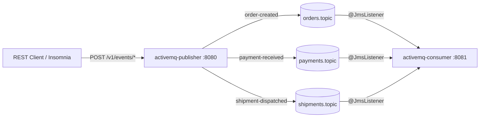
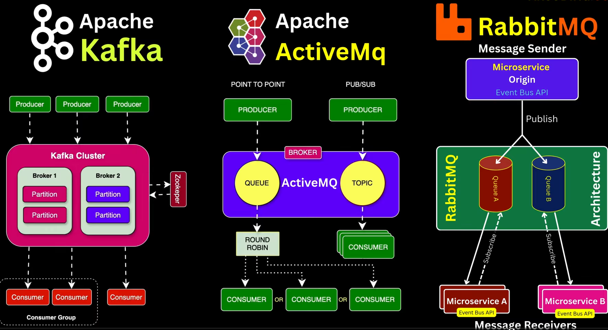
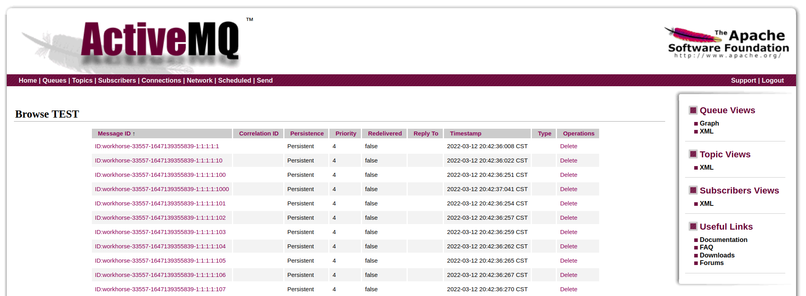

# learning-activemq

Spring Boot + ActiveMQ Classic learning project — event-driven style. A REST API publishes three typed event classes to three JMS topics; a standalone consumer subscribes with one `@JmsListener` per topic. Events travel as JSON (Jackson message converter with type-id mappings) and the shared event records live in a common module.

## Architecture



## Types 



## Modules

| Module                | Port | What it does                                                                                    |
|-----------------------|------|-------------------------------------------------------------------------------------------------|
| `activemq-common`     | —    | Shared library: the three event records + `JmsEventConverterConfig` (JSON converter)            |
| `activemq-publisher`  | 8080 | REST API (`POST /v1/events/*`) → builds an event, publishes it to its topic, stamps `messageId` |
| `activemq-consumer`   | 8081 | Three `@JmsListener`s (one per topic) — deserialize the typed event and log it                  |

All modules inherit from the root POM (shared: `spring-boot-starter-activemq`, actuator, Lombok, test) which inherits from `super-pom` (Spring Boot parent, Java toolchain, BOM).

## Events

| Event                     | Topic              | Fields                                                     |
|---------------------------|--------------------|------------------------------------------------------------|
| `OrderCreatedEvent`       | `orders.topic`     | orderId, product, quantity, amount, createdAt              |
| `PaymentReceivedEvent`    | `payments.topic`   | paymentId, orderId, amount, method, receivedAt             |
| `ShipmentDispatchedEvent` | `shipments.topic`  | shipmentId, orderId, carrier, trackingNumber, dispatchedAt |

Serialization: `JacksonJsonMessageConverter` writes JSON text messages and sets an `_event` type-id header (`order-created`, `payment-received`, `shipment-dispatched`). The consumer maps that header back to its event class — both sides share the records via `activemq-common`, and the type-id (not the class name) travels on the wire.

Topics are pub/sub (`spring.jms.pub-sub-domain: true` on both sides): every live subscriber gets a copy, and listener concurrency stays at 1 — extra topic consumers would each receive a duplicate.

Every listener also logs the JMS destination it consumed from (`from=topic://orders.topic`, `from=queue://Consumer.workerA.VirtualTopic.orders`) via the `jms_destination` header.

## Topics vs Queues in ActiveMQ

| Aspect                | Queue (point-to-point)                          | Topic (pub/sub)                                     |
|-----------------------|-------------------------------------------------|-----------------------------------------------------|
| Delivery              | Each message goes to exactly **one** consumer   | Each message goes to **every** active subscriber    |
| Multiple consumers    | Compete — broker round-robins between them      | Duplicate — each one gets its own copy              |
| Offline consumer      | Messages wait in the queue (retained)           | Message lost unless subscriber is durable           |
| Browsing (console/GUI)| Yes — pending messages + bodies visible         | No — only enqueue/dequeue counters                  |
| Typical use           | Work distribution, task processing              | Event broadcast, notifications                      |
| Spring switch         | `spring.jms.pub-sub-domain: false` (default)    | `spring.jms.pub-sub-domain: true`                   |

**Virtual topics** combine both: publish once to a topic, consume from queues. The broker watches the naming convention — any queue named `Consumer.<group>.VirtualTopic.<name>` automatically receives a **copy** of every message published to topic `VirtualTopic.<name>`. No broker config needed, just the names.

- Each *group queue* gets all messages (topic-style fan-out across groups).
- Within one group queue, competing consumers split them round-robin (queue-style work sharing).
- Same mental model as Kafka consumer groups: group = "gets all the data", consumers in the group = "share the work".

What this project runs:

| Kind          | Destination                                            | Consumers                             |
|---------------|--------------------------------------------------------|---------------------------------------|
| Plain topic   | `orders.topic`, `payments.topic`, `shipments.topic`    | 1 topic listener each                 |
| Virtual topic | `VirtualTopic.orders` (publish side only)              | — (broker copies into queues below)   |
| Queue         | `Consumer.workerA.VirtualTopic.orders`                 | 3 competing consumers (round-robin)   |
| Queue         | `Consumer.workerB.VirtualTopic.orders`                 | 3 competing consumers (round-robin)   |

So one bulk message is copied **twice** (once per worker queue), and inside each queue exactly one of the 3 consumers receives it. 100 published → 100 in workerA + 100 in workerB → ~33/33/34 per consumer thread.

## Round-robin demo (virtual topic)

`POST /v1/events/orders/bulk?count=100` publishes a numbered burst of `OrderCreatedEvent`s to the **virtual topic** `VirtualTopic.orders`. The broker mirrors every message into each `Consumer.*.VirtualTopic.orders` queue, and inside a queue the competing consumers split the work round-robin:

```
publisher ──▶ VirtualTopic.orders ──▶ Consumer.workerA.VirtualTopic.orders ──▶ 3 competing consumers (~33/33/34)
                                  └─▶ Consumer.workerB.VirtualTopic.orders ──▶ 3 competing consumers (~33/33/34)
```

- **Fan-out across queues**: workerA and workerB each receive all 100 (copies).
- **Round-robin within a queue**: the 3 consumers (`queueListenerFactory`, concurrency 3) alternate — watch `seq=1/2/3/4…` land on threads `#-1/#-2/#-3/#-1…` in the consumer log.
- Virtual-topic queues are real queues — browsable in the web console under **Queues**, unlike plain topics.

```bash
curl -X POST 'http://localhost:8080/v1/events/orders/bulk?count=100' \
  -H "Content-Type: application/json" \
  -d '{"product": "Widget", "quantity": 1, "amount": 9.99}'
```

## Prerequisites

- Java 25, Maven
- Docker (for the ActiveMQ broker)

## Run it

```bash
# 1. Start ActiveMQ
docker compose up -d

# 2. Build everything
mvn clean install

# 3. Start consumer (terminal 1)
mvn -pl activemq-consumer spring-boot:run

# 4. Start publisher (terminal 2)
mvn -pl activemq-publisher spring-boot:run

# 5. Publish events
curl -X POST http://localhost:8080/v1/events/orders \
  -H "Content-Type: application/json" \
  -d '{"product": "Laptop", "quantity": 2, "amount": 2499.98}'

curl -X POST http://localhost:8080/v1/events/payments \
  -H "Content-Type: application/json" \
  -d '{"orderId": "<orderId from above>", "amount": 2499.98, "method": "CARD"}'

curl -X POST http://localhost:8080/v1/events/shipments \
  -H "Content-Type: application/json" \
  -d '{"orderId": "<orderId>", "carrier": "DHL", "trackingNumber": "DHL-123456"}'
```

Consumer log shows one line per event:

```
Consumed order-created id=<uuid> orderId=<uuid> product=Laptop qty=2 amount=2499.98
Consumed payment-received id=<uuid> paymentId=<uuid> orderId=<...> amount=2499.98 method=CARD
Consumed shipment-dispatched id=<uuid> shipmentId=<uuid> orderId=<...> carrier=DHL tracking=DHL-123456
```

## API

All endpoints return `202 Accepted` with the same response shape:

```json
{
  "messageId": "1c1f9d2e-…",
  "eventType": "order-created",
  "topic": "orders.topic",
  "publishedAt": "2026-07-17T19:00:00Z"
}
```

| Endpoint                    | Request body                                            | Validation                                |
|-----------------------------|---------------------------------------------------------|-------------------------------------------|
| `POST /v1/events/orders`    | `{"product", "quantity", "amount"}`                     | product not blank, both positive          |
| `POST /v1/events/payments`  | `{"orderId", "amount", "method"}`                       | orderId/method not blank, amount positive |
| `POST /v1/events/shipments` | `{"orderId", "carrier", "trackingNumber"}`              | all not blank                             |

Invalid payloads get `400`. The server generates the entity id (`orderId`, `paymentId`, `shipmentId`) and timestamp.

## ActiveMQ

| Thing                 | Value                                               |
|-----------------------|-----------------------------------------------------|
| Broker (OpenWire/JMS) | `tcp://localhost:61616`                             |
| Web console           | <http://localhost:8161> — `admin` / `admin`         |
| Topics                | `orders.topic`, `payments.topic`, `shipments.topic` |
| Image                 | `apache/activemq-classic:6.1.7`                     |



Watch the topics in the console under **Topics** — enqueued/dequeued counters move as you publish. Start the consumer first: topic messages are not retained for subscribers that aren't connected.

## Configuration

Overridable via env vars (12-factor style):

| Env var                               | Default                 | Used by |
|---------------------------------------|-------------------------|---------|
| `ACTIVEMQ_BROKER_URL`                 | `tcp://localhost:61616` | both    |
| `ACTIVEMQ_USER` / `ACTIVEMQ_PASSWORD` | `admin` / `admin`       | both    |

Topic names live under `app.topics.*` in each module's `application.yml`.

## Insomnia

Import `insomnia-collection.json` — one request per event type + health checks for both modules.

## Observability

Actuator on both modules: `/actuator/health`, `/actuator/metrics`, `/actuator/prometheus`.
