# ActiveMQ Deep Dive

Companion doc to the project README — everything you need to reason about ActiveMQ Classic, with diagrams. Each section stands alone; skim the diagrams first, read the prose when needed.

---

## Table of Contents

1. [What is ActiveMQ](#1-what-is-activemq)
2. [Broker architecture](#2-broker-architecture)
3. [Destinations: queues](#3-destinations-queues)
4. [Destinations: topics](#4-destinations-topics)
5. [Anatomy of a message](#5-anatomy-of-a-message)
6. [Message consumption: prefetch and dispatch](#6-message-consumption-prefetch-and-dispatch)
7. [Acknowledgement modes and transactions](#7-acknowledgement-modes-and-transactions)
8. [Competing consumers and round-robin](#8-competing-consumers-and-round-robin)
9. [Durable subscriptions](#9-durable-subscriptions)
10. [Virtual topics](#10-virtual-topics)
11. [Persistence: KahaDB](#11-persistence-kahadb)
12. [Redelivery and dead-letter queues](#12-redelivery-and-dead-letter-queues)
13. [Selectors, exclusive consumers, message groups](#13-selectors-exclusive-consumers-message-groups)
14. [Scheduled and delayed delivery](#14-scheduled-and-delayed-delivery)
15. [Memory limits and flow control](#15-memory-limits-and-flow-control)
16. [High availability and networks of brokers](#16-high-availability-and-networks-of-brokers)
17. [Spring Boot integration model](#17-spring-boot-integration-model)
18. [Monitoring: console, JMX, advisory topics](#18-monitoring-console-jmx-advisory-topics)
19. [ActiveMQ vs Kafka vs RabbitMQ](#19-activemq-vs-kafka-vs-rabbitmq)
20. [How this project maps to all of the above](#20-how-this-project-maps-to-all-of-the-above)

---

## 1. What is ActiveMQ

ActiveMQ is a **message broker**: a server that sits between applications and moves messages from producers to consumers so the two sides never talk directly. Decoupling in three dimensions:

- **Space** — producer doesn't know who consumes, or how many.
- **Time** — consumer may be down; queue holds the message until it returns.
- **Load** — burst of 10k messages doesn't crash a consumer that processes 100/s; the queue absorbs the spike.

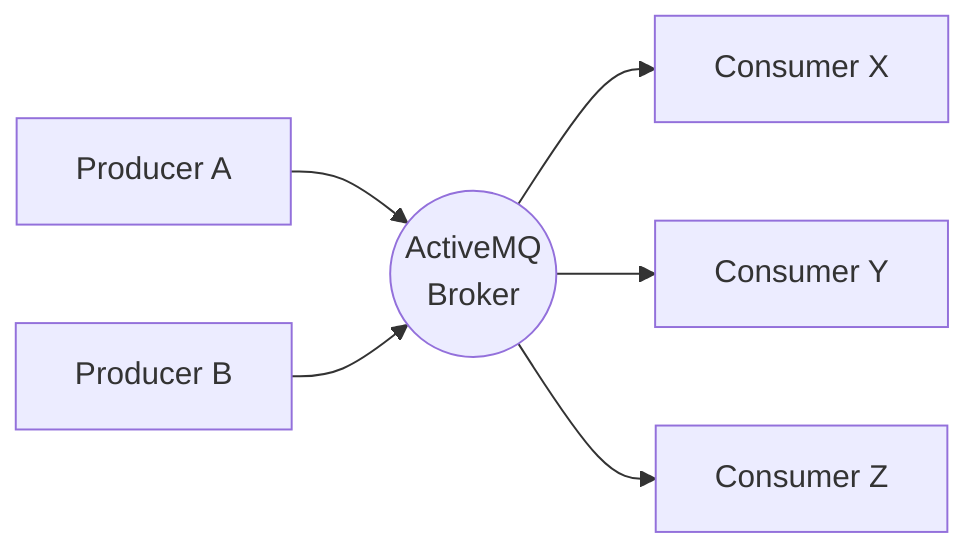

Two products share the name:

| | ActiveMQ **Classic** (this project) | ActiveMQ **Artemis** |
|---|---|---|
| Lineage | Original codebase (2004+) | HornetQ donation, next-gen |
| Threading | Thread-per-connection oriented | Reactor / async core |
| Persistence | KahaDB journal | Own append-only journal |
| Protocols | OpenWire native; STOMP, AMQP, MQTT, WS | Same set, AMQP first-class |
| Future | Maintenance + steady releases | Where new features land |

ActiveMQ implements **JMS** (Jakarta Messaging) — the Java standard API for messaging — so application code depends on `jakarta.jms.*` interfaces, not on ActiveMQ classes. Swap the broker, keep the code.

---

## 2. Broker architecture

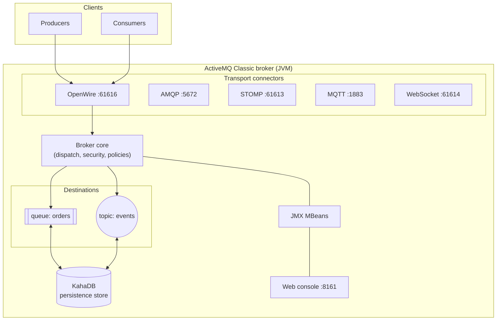

Key pieces:

- **Transport connectors** — one broker, many wire protocols. JVM clients use **OpenWire** (fastest, full feature set). Cross-language clients use AMQP/STOMP/MQTT. The URL `tcp://localhost:61616` in `application.yml` is the OpenWire connector.
- **Broker core** — routing, security (authentication/authorization plugins), per-destination policies (memory limits, DLQ strategy, prefetch defaults).
- **Destinations** — named queues and topics, created on demand by default (first producer/consumer creates them — that's why the project needs zero broker config).
- **Persistence store** — messages marked persistent survive broker restart (see §11).
- **JMX + web console** — every queue/topic/connection is an MBean; the console at :8161 is a UI over them.

---

## 3. Destinations: queues

**Point-to-point.** Each message is delivered to **exactly one** consumer, no matter how many are attached. Undelivered messages wait — minutes or days — until someone consumes or they expire.

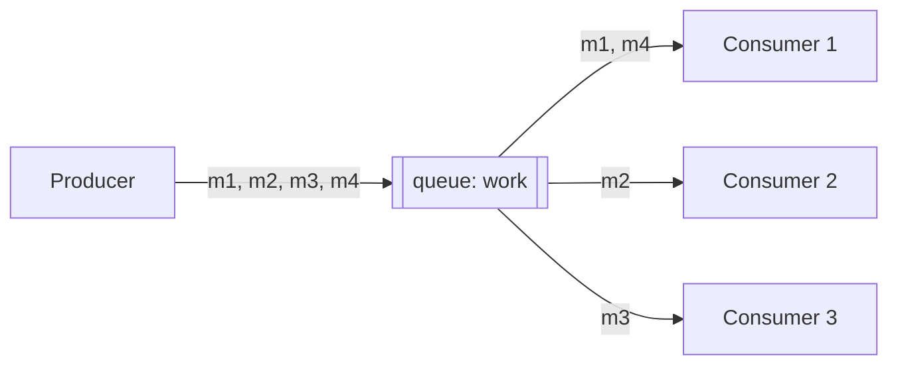

Properties:

- **Retention** — messages stay until consumed, expired (TTL), or purged. A queue is a buffer.
- **Competing consumers** — multiple consumers on one queue split the messages (see §8). This is *the* horizontal-scaling primitive for work processing.
- **Browsable** — you can look at pending messages (web console → Queues → click message; or JMS `QueueBrowser`) without consuming them.
- **Ordering** — FIFO as enqueued, but competing consumers can complete out of order. Strict ordering needs a single consumer or message groups (§13).

Use for: task distribution, order processing, anything where each unit of work must be handled once.

---

## 4. Destinations: topics

**Publish/subscribe.** Each message is delivered to **every** subscriber that is connected at publish time. Subscribers do not compete — they each get a full copy.

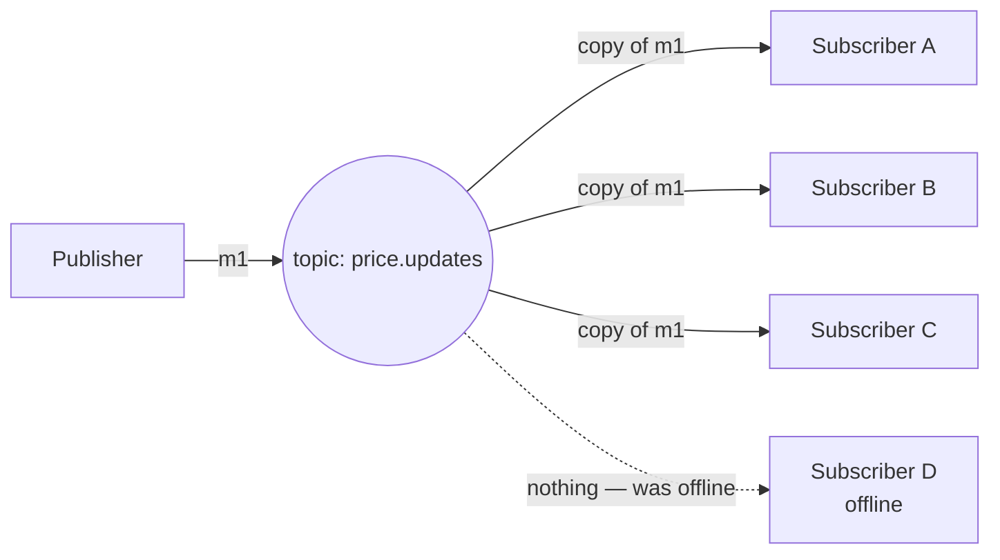

Properties:

- **No retention** — a topic is a broadcast, not a buffer. Offline at publish time → message missed forever (unless the subscription is *durable*, §9).
- **No browsing** — nothing is stored, so the console shows only counters.
- **Adding consumers duplicates work** — two subscribers running the same code both process every message. That's why this project keeps topic listener concurrency at 1.

Use for: event notification, cache invalidation, live feeds — anything where "whoever cares right now should hear this".

**The one-slide summary:**

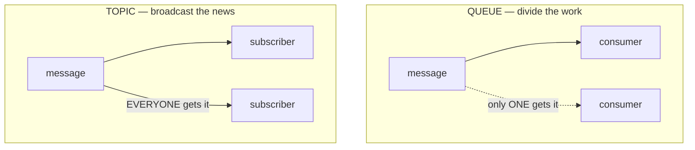

---

## 5. Anatomy of a message

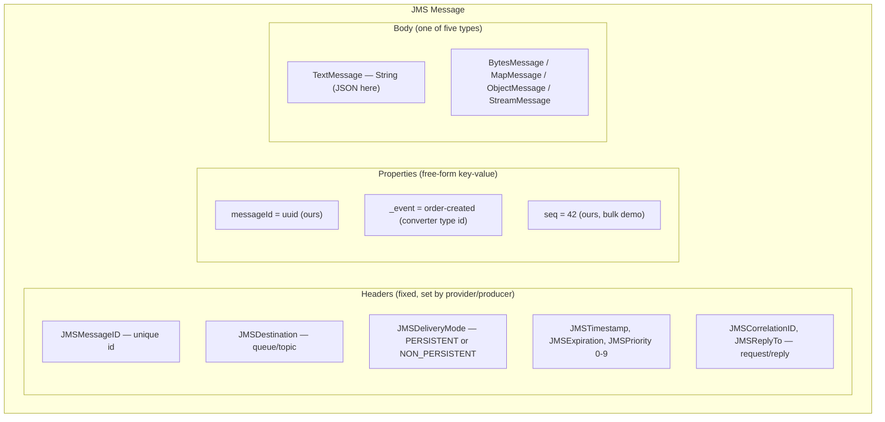

Details worth knowing:

- **Properties are for routing and filtering** — selectors (§13) can only see headers + properties, never the body. That's why the type id (`_event`) travels as a property, not inside the JSON.
- **`JMSDeliveryMode`** — `PERSISTENT` (default): broker writes to KahaDB before acking the producer; survives restart. `NON_PERSISTENT`: memory only, faster, lost on broker crash.
- **`JMSExpiration`** — set via producer TTL. Expired messages are dropped (or sent to DLQ depending on policy).
- **`JMSPriority`** — 0–9; broker makes a best effort to deliver higher priority first.
- **`JMSCorrelationID` + `JMSReplyTo`** — the request/reply pattern over messaging: send with `JMSReplyTo=tempQueue`, responder copies your `JMSMessageID` into `JMSCorrelationID` of the answer.

---

## 6. Message consumption: prefetch and dispatch

ActiveMQ **pushes** messages to consumers (unlike Kafka's pull). To keep pipelines full, it pushes ahead of consumption — the **prefetch buffer**.

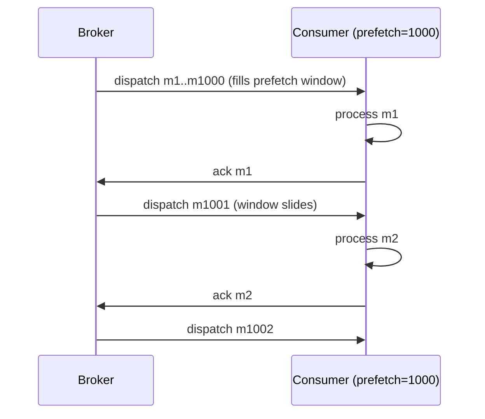

- Default prefetch: **1000** for queues, very large for topics.
- **Trade-off**: big prefetch = throughput (no round-trip per message); small prefetch = fairness. With prefetch 1000 and two consumers, the first may grab 1000 while the second sits idle — for slow tasks set prefetch to 1 so each consumer takes one at a time.
- Configure per connection URL (`tcp://host:61616?jms.prefetchPolicy.queuePrefetch=1`) or per destination.
- Our 34/33/33 round-robin split works because messages arrived faster than processing and the broker dealt them across the three *sessions* evenly.

---

## 7. Acknowledgement modes and transactions

A message is only *gone* from the broker when acknowledged. Who acks, and when, defines your delivery guarantee:

| Mode | Who acks | Guarantee | Notes |
|---|---|---|---|
| `AUTO_ACKNOWLEDGE` | Provider, after listener returns | At-least-once | Spring's default; redelivered if listener throws |
| `CLIENT_ACKNOWLEDGE` | Your code (`message.acknowledge()`) | At-least-once | Acks *all* messages consumed so far in the session |
| `DUPS_OK_ACKNOWLEDGE` | Provider, lazily in batches | At-least-once, dups likely | Fastest, use when idempotent |
| Transacted session | `session.commit()` | All-or-nothing batch | Rollback ⇒ everything redelivered |

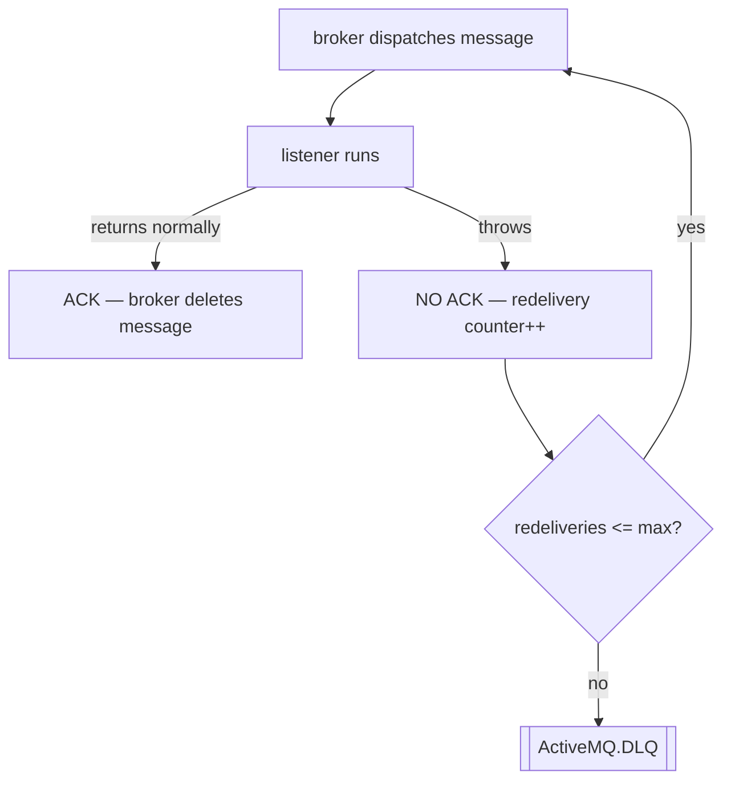

**Exactly-once does not exist** over the wire — you get at-least-once plus an idempotent consumer (dedupe on `JMSMessageID`/business key), or transactions within one broker. Design consumers to tolerate duplicates.

---

## 8. Competing consumers and round-robin

The scaling pattern this project demos with the bulk endpoint. N consumers on one queue; the broker distributes messages among them — with equal prefetch and processing speed, effectively **round-robin**.

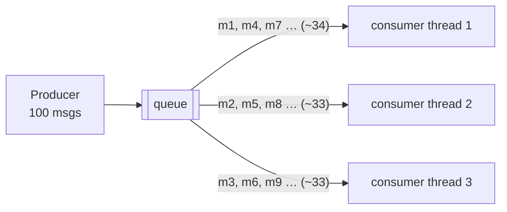

- Scale out = add consumers; scale in = remove them. Broker rebalances automatically, nothing to configure.
- A slow consumer naturally receives less (its prefetch window stays full) — poor man's load-aware routing.
- Ordering across consumers is **lost** — see message groups (§13) when a sub-stream must stay ordered.
- In Spring this is one line: listener container `concurrency = "3-3"` (three sessions competing on the same queue).

Measured in this project (100-message burst): threads split 34/33/33 with `seq` alternating thread-1, thread-2, thread-3, thread-1…

---

## 9. Durable subscriptions

Plain topic subscribers miss messages published while they're offline. A **durable subscription** makes the broker remember the subscriber and buffer what it missed.

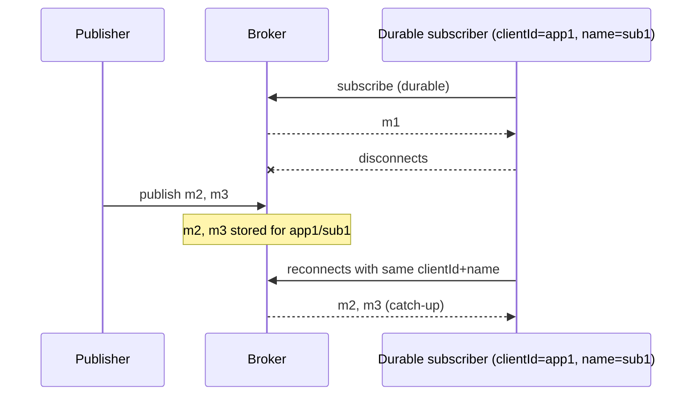

- Identity = `clientId` + subscription name. Reconnect with the same pair → resume; different pair → new subscription, history lost.
- One active consumer per durable subscription (classic limitation) — you can't compete on one. That's exactly the problem **virtual topics** solve (§10): queue semantics per subscriber group, so groups can both catch up *and* scale out.
- JMS 2.0 "shared durable subscriptions" allow competing, but virtual topics remain the idiomatic ActiveMQ Classic answer.

---

## 10. Virtual topics

The best of both worlds and the core trick of this project's round-robin demo. Publish **once** to a topic; consume from **queues**.

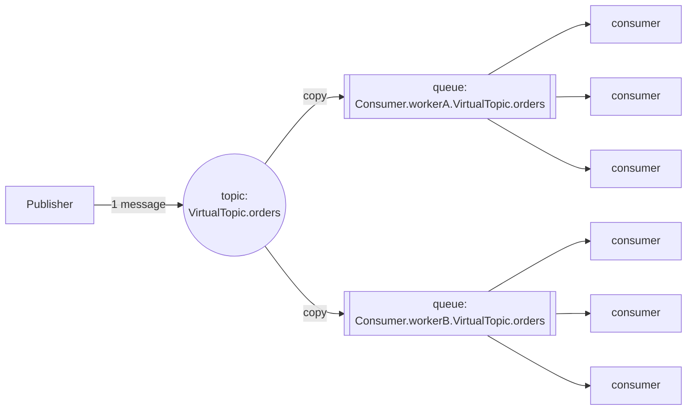

How it works — **pure naming convention, zero broker config**:

1. Publisher sends to a topic named `VirtualTopic.<name>`.
2. Broker intercepts and copies each message into every queue matching `Consumer.<group>.VirtualTopic.<name>` that exists (a queue exists as soon as one consumer subscribed to it).
3. Each group queue behaves like a normal queue: retention, browsing, DLQ, competing consumers.

What each layer gives you:

| Layer | Semantics | Kafka analogy |
|---|---|---|
| `VirtualTopic.orders` | fan-out to all groups | the topic |
| `Consumer.workerA.*` queue | group gets every message | consumer group A |
| 3 consumers on that queue | round-robin work sharing | partitions consumed within group |

Gotchas:

- Names are magic: default prefixes `VirtualTopic.` and `Consumer.` are configurable broker-side but the convention is the API.
- A group that has *never* connected gets nothing retroactively — the queue must exist (first consumer creates it) before messages are copied in.
- Copies are independent: workerA nacking a message into DLQ doesn't affect workerB's copy.

---

## 11. Persistence: KahaDB

Where persistent messages live between arrival and ack. KahaDB is a **write-ahead journal + index**, purpose-built for messaging (append-heavy, delete-on-ack).

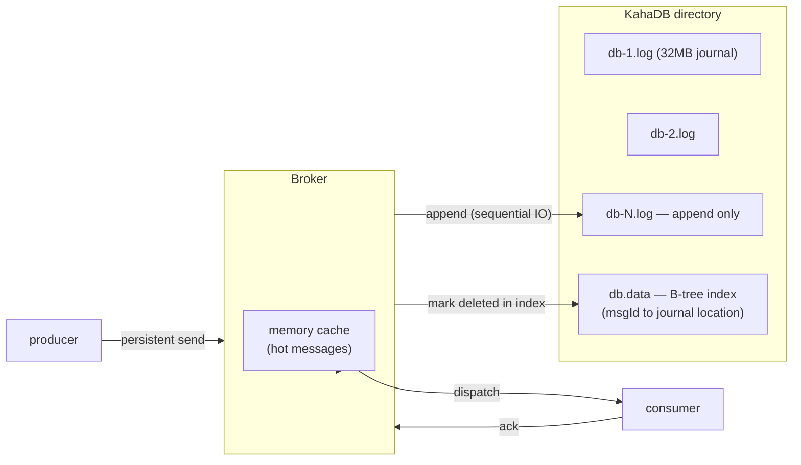

- **Send path**: persistent message → appended to current journal file → fsync (configurable) → producer gets ack. Sequential writes = fast even on spinning disks.
- **Ack path**: message marked consumed in the index; journal files whose messages are *all* consumed are garbage-collected whole. One stuck message in a 32MB file keeps the entire file alive — a classic "why is my disk full" incident.
- Non-persistent messages skip the journal (memory, spill to temp store under pressure).
- The docker volume `activemq-data` in this project's compose file is exactly this directory — broker restarts keep queue contents.

---

## 12. Redelivery and dead-letter queues

When a listener throws, the message is redelivered; when it keeps failing, it's parked in a **dead-letter queue** instead of poisoning the consumer forever.

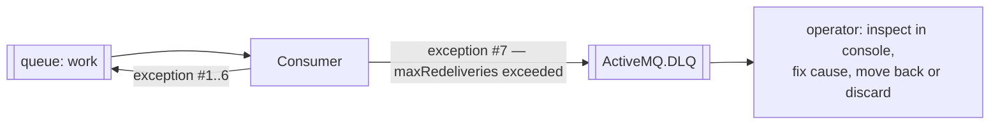

- Default policy: 6 redeliveries, then to the shared `ActiveMQ.DLQ`. Configure per destination: individual DLQs (`queue.work.DLQ`), backoff/exponential delay between attempts, whether non-persistent messages also DLQ.
- Redelivered messages carry `JMSRedelivered=true` and `JMSXDeliveryCount` — consumers can branch on it ("third attempt → log loudly").
- DLQ is a normal queue: browsable, consumable — build a small "retry" tool or use the console's Move operation.
- **Poison message** = message that always fails (bad JSON, impossible state). Without DLQ it would loop forever, blocking everything behind it at prefetch 1.

---

## 13. Selectors, exclusive consumers, message groups

Three routing refinements, all consumer-side:

**Selectors** — SQL92-ish filter over headers/properties. Broker delivers only matching messages.

```java
@JmsListener(destination = "orders", selector = "region = 'EU' AND amount > 100")
```

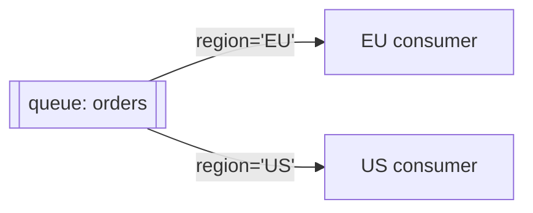

Caution: a queue with selective consumers can strand messages nobody selects.

**Exclusive consumer** — many connected, broker picks one to receive *everything*; on its death the next takes over. Cheap active/passive failover with strict ordering.

```java
// destination: work?consumer.exclusive=true
```

**Message groups** — ordered sub-streams inside a shared queue. Set `JMSXGroupID`; all messages of one group go to one consumer (sticky), different groups spread across consumers.

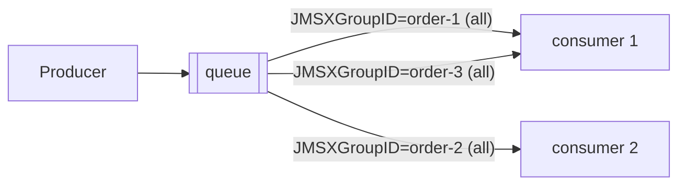

Per-order strict ordering **and** horizontal scaling — same idea as Kafka partition keys.

---

## 14. Scheduled and delayed delivery

Broker-side timer (enable with `schedulerSupport="true"`). Producer stamps delay properties; broker holds the message and enqueues at the right moment.

| Property | Meaning |
|---|---|
| `AMQ_SCHEDULED_DELAY` | deliver after N ms |
| `AMQ_SCHEDULED_PERIOD` + `AMQ_SCHEDULED_REPEAT` | redeliver every period, N times |
| `AMQ_SCHEDULED_CRON` | cron expression |

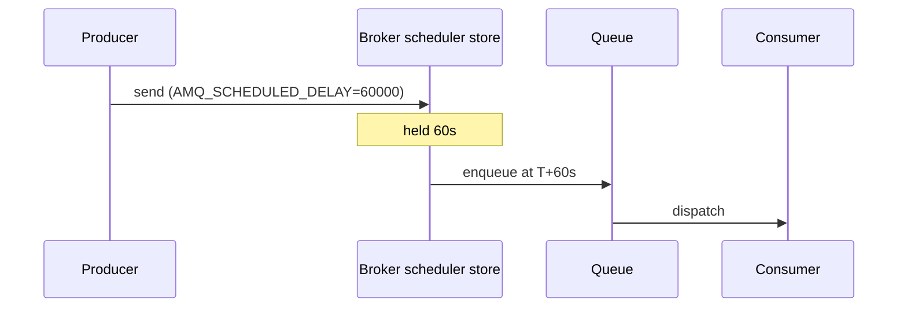

Use for: retry-with-backoff queues, reminder events, SLA timers. (The console's **Scheduled** tab lists held messages.)

---

## 15. Memory limits and flow control

The broker protects itself from fast producers + slow consumers with a hierarchy of limits:

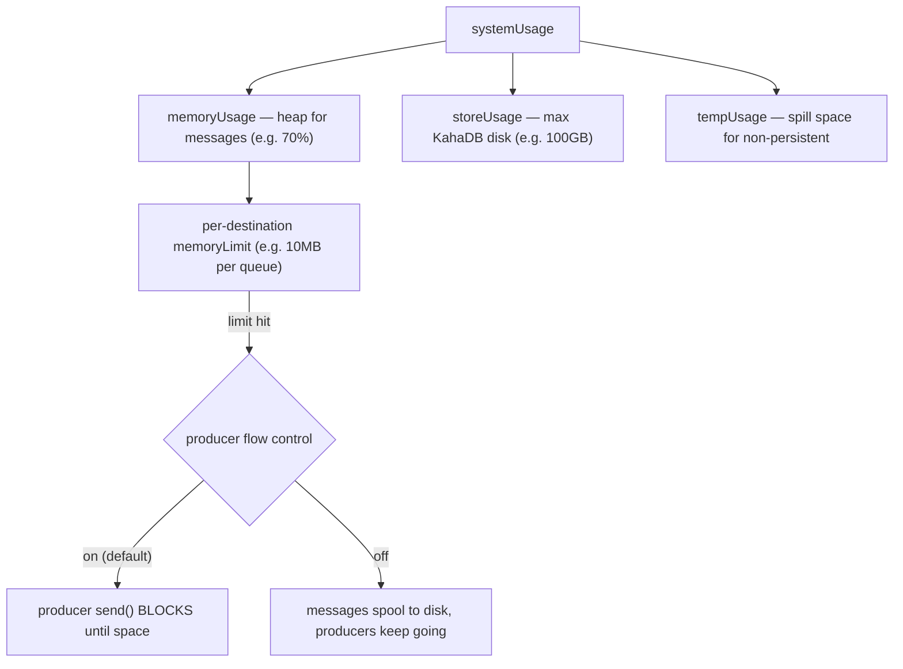

- **Producer flow control on** (default): a full queue back-pressures producers — `send()` blocks. Great for keeping the system honest, surprising when your REST thread hangs because a consumer died.
- **Flow control off**: broker pages messages to disk; producers stay fast until *disk* limits hit.
- Symptoms to recognize: producers mysteriously freezing → check destination memory limit and consumer health first.

---

## 16. High availability and networks of brokers

**Master/slave (shared store)** — the classic HA pair. Both brokers point at the same KahaDB; whoever holds the file lock is master, the other waits. Clients use a failover URL and reconnect automatically.

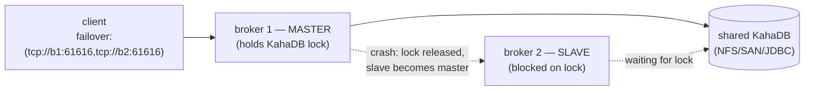

**Network of brokers** — scale *out*: brokers interconnect and forward messages to where the consumers are (store-and-forward). Used for geographic distribution or sheer connection count.

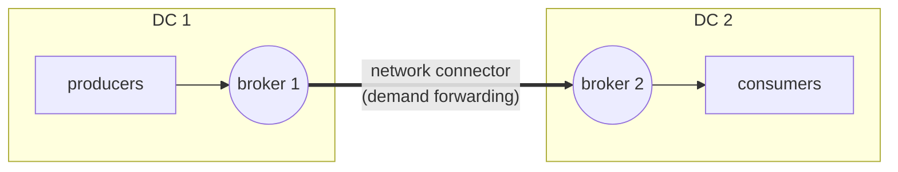

Rule of thumb: messages flow **toward demand** — a broker only forwards a queue's messages when the remote broker has consumers for it.

---

## 17. Spring Boot integration model

What `spring-boot-starter-activemq` wires for you, and how the pieces in this repo connect:

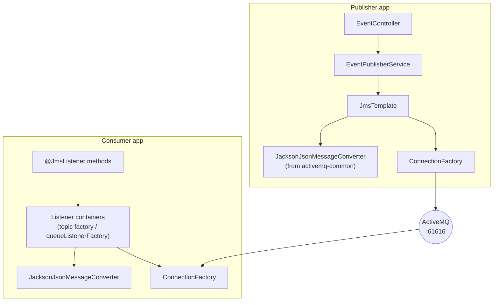

- **`ConnectionFactory`** — auto-configured from `spring.activemq.*` properties. Production tip: wrap in a pooled factory (`spring.activemq.pool.enabled=true` with the pooled-jms dependency) — creating raw connections per send is expensive.
- **`JmsTemplate`** — thread-safe sender; `convertAndSend(dest, obj, postProcessor)` runs the object through the `MessageConverter` bean and lets the post-processor stamp properties (our `messageId`, `seq`).
- **`@JmsListener`** — each annotation gets a listener container from a factory. The container owns sessions/consumers (concurrency), invokes your method, acks on normal return, triggers redelivery on exception. Two factories in this project: default (topic mode, concurrency 1) and `queueListenerFactory` (queue mode, concurrency 3).
- **`MessageConverter`** — single bean shared by both directions; the `_event` type-id property maps records without leaking Java class names into the wire format.
- **`pub-sub-domain`** — the yml switch that decides whether unadorned destinations mean topics or queues; a container factory can override it (exactly what `queueListenerFactory` does).

---

## 18. Monitoring: console, JMX, advisory topics

**Web console** (`:8161/admin`) — Queues (pending/enqueued/dequeued, browse bodies, purge, move), Topics (counters only), Subscribers (durable subs), Connections, Scheduled, Send (inject test messages by hand).

**JMX** — every destination and connection is an MBean (`jconsole` → `org.apache.activemq` domain). The numbers that matter:

| Metric | Smell when… |
|---|---|
| `QueueSize` | grows steadily → consumers dead or too slow |
| `ConsumerCount` | 0 on a queue that should have workers |
| `EnqueueCount` vs `DequeueCount` | diverging → backlog forming |
| `MemoryPercentUsage` | near 100 → producer flow control imminent |
| `ExpiredCount` | messages dying of TTL unnoticed |

**Advisory topics** — the broker narrates its own life on `ActiveMQ.Advisory.*` topics: consumer started/stopped, queue created, message DLQ'd, slow consumer detected. Subscribe like any topic — free building block for ops tooling.

```mermaid
flowchart LR
    b((broker)) -->|"ActiveMQ.Advisory.Consumer.Queue.work"| mon[monitoring app]
    b -->|"ActiveMQ.Advisory.MessageDLQd.*"| alert[alerting]
```

---

## 19. ActiveMQ vs Kafka vs RabbitMQ

| | ActiveMQ Classic | Kafka | RabbitMQ |
|---|---|---|---|
| Model | JMS broker (queues + topics) | Distributed **log** (partitions, offsets) | AMQP broker (exchanges → queues) |
| Message after consume | Deleted on ack | **Retained** (retention window); consumers track offsets | Deleted on ack |
| Replay old messages | No (gone once acked) | Yes — rewind offset | No |
| Fan-out + work sharing | Virtual topics | Consumer groups (native) | Exchange bound to N queues |
| Ordering | Per queue; message groups for keyed order | Per partition (key → partition) | Per queue |
| Throughput ceiling | Tens of thousands msg/s | Millions msg/s (sequential log, zero-copy) | Hundreds of thousands |
| Latency | Low (push) | Low-ish (batched pull) | Low (push) |
| Protocol | OpenWire/JMS + AMQP/STOMP/MQTT | Custom binary | AMQP 0-9-1 |
| Delayed/scheduled msgs | Built-in scheduler | Not built-in | Plugin / TTL+DLX tricks |
| Best fit | JMS shops, task queues, req/reply | Event streaming, replay, big pipelines | Complex routing, multi-protocol |

The virtual-topic pattern in this repo is ActiveMQ speaking Kafka's dialect: `VirtualTopic.orders` ≈ Kafka topic, group queue ≈ consumer group, competing consumers ≈ partition consumption — minus replay, because queues delete on ack.

---

## 20. How this project maps to all of the above

| Concept (section) | Where it lives in this repo |
|---|---|
| Plain topics (§4) | `orders.topic`, `payments.topic`, `shipments.topic`; `EventListeners` |
| Typed messages, properties (§5) | `_event` type id, `messageId`, `seq` properties; JSON `TextMessage` |
| Push + prefetch (§6) | defaults; visible in even 34/33/33 spread |
| Auto-ack / redelivery (§7) | Spring default `AUTO_ACKNOWLEDGE`; throw in a listener to watch redelivery → `ActiveMQ.DLQ` |
| Competing consumers (§8) | `queueListenerFactory` concurrency 3-3 |
| Virtual topics (§10) | `VirtualTopic.orders` → `Consumer.workerA/workerB.VirtualTopic.orders`; bulk endpoint |
| KahaDB (§11) | `activemq-data` docker volume |
| Console (§18) | compose port 8161; worker queues browsable |
| Spring wiring (§17) | `JmsEventConverterConfig` (common), `QueueListenerConfig` (consumer), `EventPublisherService` (publisher) |

Experiments to try next, ordered by effort:

1. Throw an exception for `seq % 10 == 0` in a worker listener → watch redelivery then `ActiveMQ.DLQ` fill (§12).
2. Set `?consumer.exclusive=true` on a worker queue destination → observe one thread taking everything (§13).
3. Stamp `JMSXGroupID = orderId` in the bulk publisher → per-order stickiness across the 3 consumers (§13).
4. Add `AMQ_SCHEDULED_DELAY` to one event (enable `schedulerSupport`) → delayed consumption (§14).
5. Stop the consumer, publish a burst, check console: worker queues hold messages (retention), plain topics dropped theirs (§3 vs §4).
